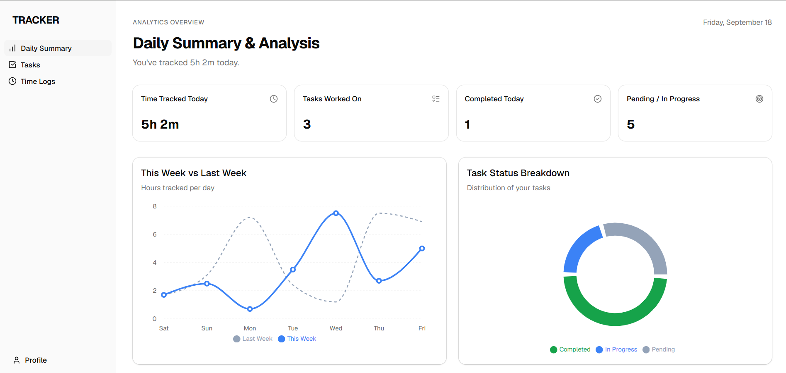
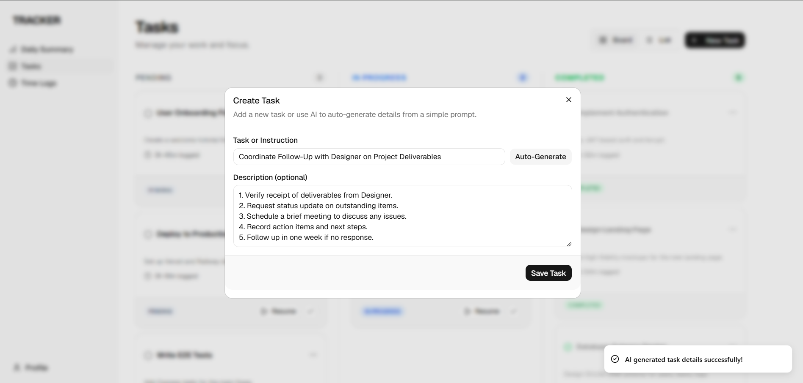
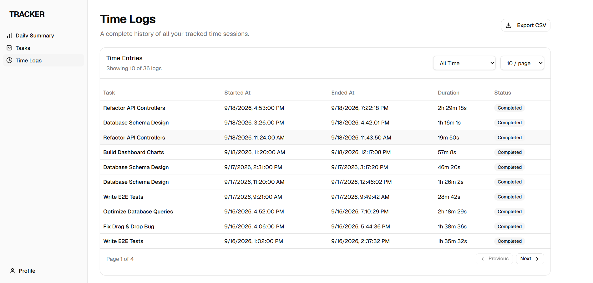

# Task & Time Tracking Dashboard

A full-stack application that allows users to manage tasks, track time spent with a real-time timer, and view daily productivity summaries. Features a beautiful, modern UI and AI-powered task generation.

## Features

- **Secure Authentication**: JWT-based auth with strict data isolation.
- **Task Management**: Full CRUD operations for tasks with status tracking.
- **AI Task Generation**: Automatically generate professional task titles and structured descriptions using Groq AI (`openai/gpt-oss-20b`).
- **Real-Time Time Tracking**: Server-side timer calculations for accuracy, preventing multiple active timers, and seamless resume on refresh.
- **Productivity Dashboard**: Daily and weekly summaries with Recharts visualizations.
- **Time Logs & CSV Export**: Paginated history of all sessions with one-click export to CSV.

## Tech Stack

- **Frontend**: React 18, Vite, TypeScript, Tailwind CSS, Shadcn UI, Recharts, React Router v6.
- **Backend**: Node.js, Express, TypeScript, Zod validation.
- **Database**: PostgreSQL with Drizzle ORM.
- **AI Integration**: Groq SDK for natural language task generation.

## Local Development Setup

### Prerequisites
- Node.js (v18+)
- PostgreSQL installed and running

### 1. Database Setup
1. Create a PostgreSQL database (e.g., `suno_db`).
2. Navigate to the `backend` folder and create a `.env` file based on `.env.example`:
```bash
cd backend
cp .env.example .env
```
3. Update `DATABASE_URL` in your `.env` with your Postgres credentials.
4. Add your `GROQ_API_KEY` to the `.env`.

### 2. Backend Setup
```bash
cd backend
npm install
npm run db:push     # Push Drizzle schema to the database
npm run dev         # Starts backend on http://localhost:3000
```

### 3. Frontend Setup
```bash
cd frontend
npm install
npm run dev         # Starts frontend on http://localhost:5173
```

## Live Demo
**Frontend URL:** [https://tracker-chi-blue.vercel.app/](https://tracker-chi-blue.vercel.app/)

**Demo Login Credentials:**
- **Email:** `dipenntalreja@gmail.com`
- **Password:** `password123`

## Deployment
- **Frontend**: Deployed on Vercel. Includes a `vercel.json` for proper React Router SPA fallback.
- **Backend**: Deployed on Render.
- **Database**: We use **Neon** for our serverless Postgres database. Simply retrieve the Postgres connection string from your Neon dashboard and set it as the `DATABASE_URL` environment variable on your backend host.

SCREENSHOTS


